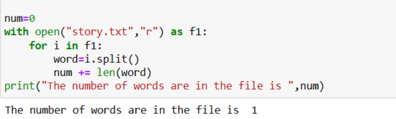

# Word-Count
## AIM:
To write a python program for getting the word count from a text.
## EQUIPEMENT'S REQUIRED: 
PC
Anaconda - Python 3.7
## ALGORITHM: 
### Step 1:
     Start the program
### Step 2: 
     create a file story.txt in anacoda navigator
### Step 3: 
     write a program to count
### Step 4:  
    run the program
### Step 5: 
    print the output
### Step 6: 
    end the program
## PROGRAM:
```
program to find the number of words in a text file
Developed by : HYCINTH D
Register number : 212223240055

num=0
with open("story.txt","r") as f1:
    for i in f1:
        word=i.split()
        num += len(word)
print("The number of words are in the file is ",num)
```

### OUTPUT:



## RESULT:
Thus the program is written to find the word count from a text.
